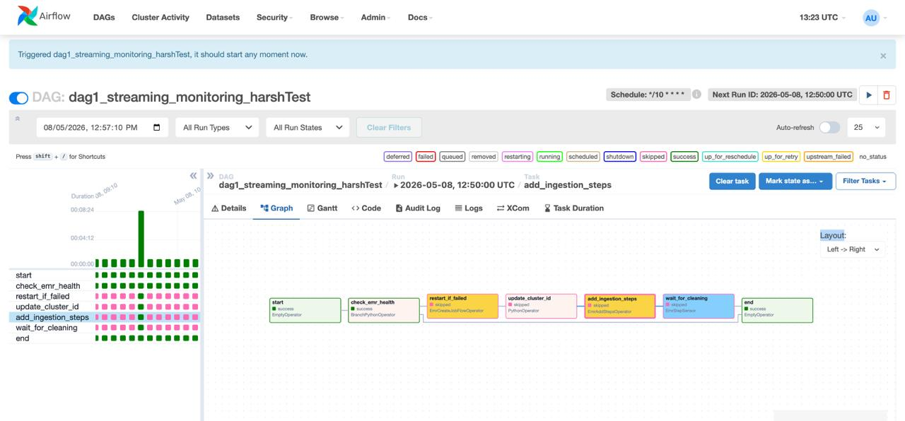
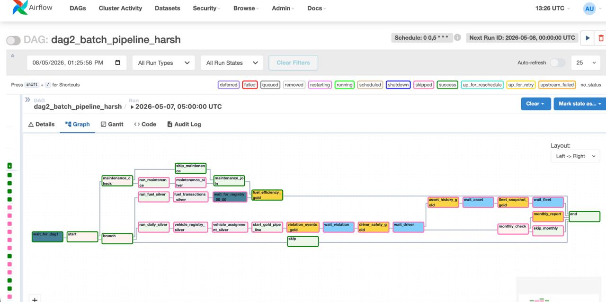
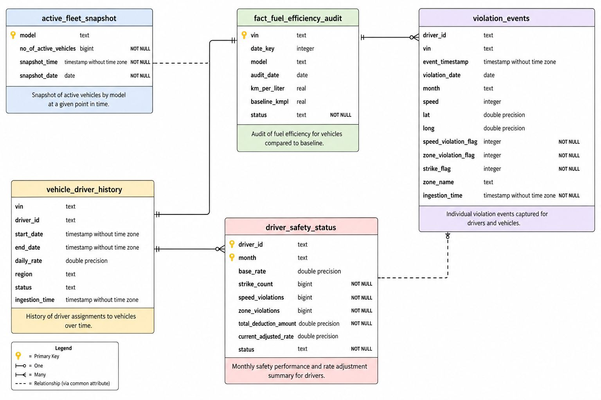
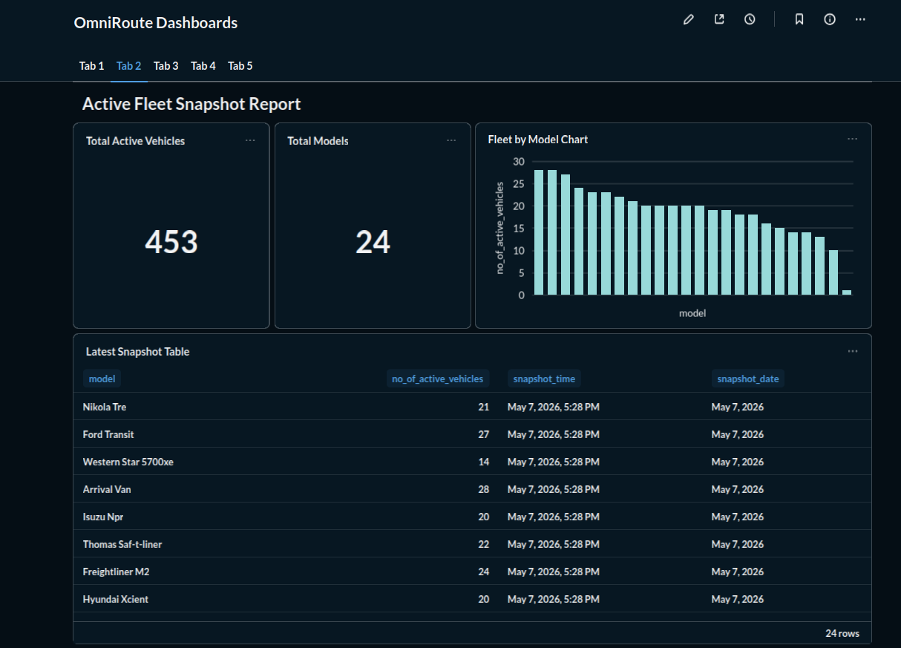
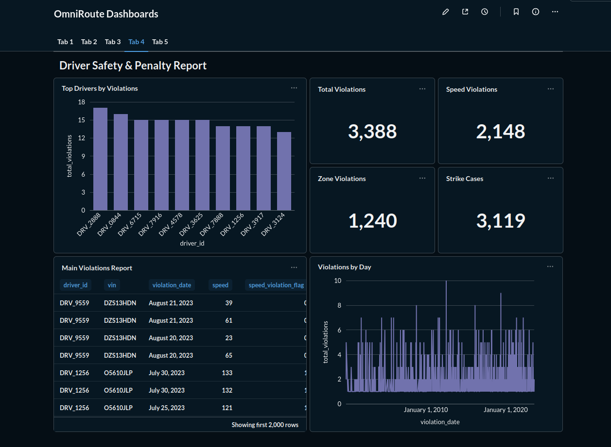
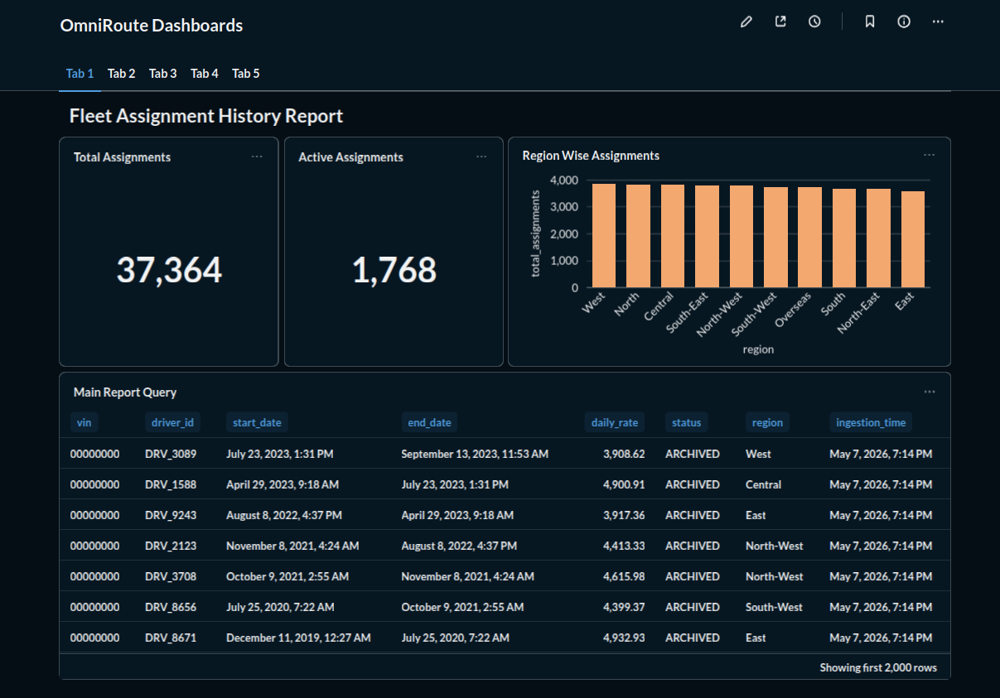
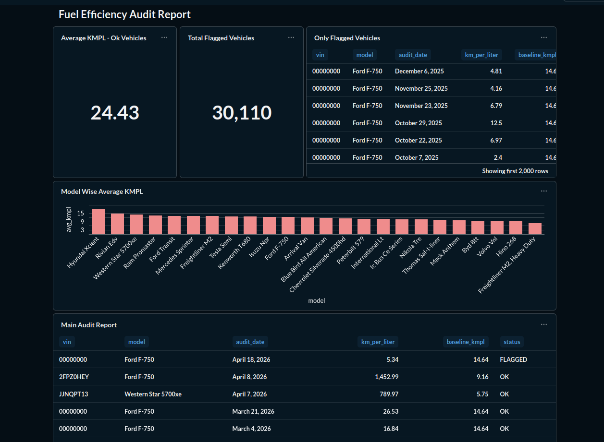
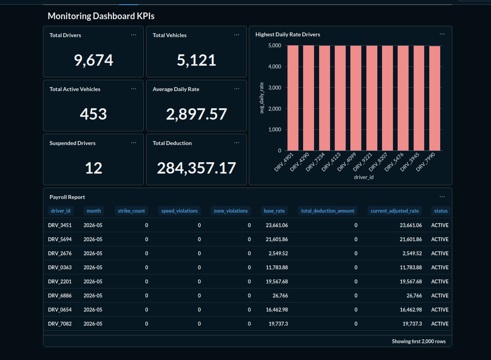

# 🚚 OmniRoute – Smart Logistics Data Engineering Pipeline

OmniRoute is an **end-to-end logistics analytics platform** built using **AWS, Apache Spark, Kafka, Airflow, Glue, EMR, S3, and PostgreSQL**.

This project simulates a real-world logistics company where both **streaming + batch data pipelines** process vehicle, driver, fuel, maintenance, and compliance data to generate business insights.

---

## 📌 Project Overview

The goal of this project is to build a scalable logistics monitoring system that:

* Processes **real-time telemetry streaming data** using Kafka + Spark Streaming on EMR
* Processes **batch datasets** using AWS Glue
* Stores raw → cleaned → transformed data in Bronze/Silver/Gold layers
* Automates workflows using Apache Airflow
* Stores analytical tables in PostgreSQL
* Creates KPI dashboards for business monitoring

---

# 🏗️ Architecture

## Data Flow

```text
Data Sources
   ↓
Kafka Producer / CSV / JSON Files
   ↓
Bronze Layer (Raw Data in S3)
   ↓
Silver Layer (Cleaned/Transformed Data)
   ↓
Gold Layer (Analytics Tables)
   ↓
PostgreSQL
   ↓
Dashboards / Reporting
```

---

# ⚙️ Tech Stack

| Technology           | Purpose                    |
| -------------------- | -------------------------- |
| AWS S3               | Data Lake Storage          |
| AWS EMR              | Spark Streaming Processing |
| AWS Glue             | Batch ETL Processing       |
| Apache Kafka         | Real-time Streaming        |
| Apache Spark         | Data Processing            |
| Apache Airflow       | Workflow Orchestration     |
| PostgreSQL           | Data Warehouse             |
| Python               | ETL Development            |
| Power BI / Dashboard | Visualization              |

---

# 📂 Project Structure

```bash
OmniRoute_Project/
│
├── Bronze_Layer/
│   ├── fuel_transactions_100knew.csv
│   ├── maintenance_30k.csv
│   ├── restricted_zones.json
│   ├── telemetry_v2_10k.json
│   ├── vehicle_assignment_100k.csv
│   └── vehicle_registry_10k.csv
│
├── Silver_Layer/
│   ├── Streaming/
│   └── Glue_Jobs_BatchData/
│
├── Gold_layer/
│
├── DAG_Codes/
│   ├── dag_1.py
│   ├── dag_2.py
│
├── ER_Diagram/
│
└── BI_Dashboards/
```

---

# 🔄 Pipeline DAGs

## DAG 1



---

## DAG 2



---

# 🗄️ ER Diagram

This diagram shows the relationship between fact and dimension tables.



---

# 📊 Dashboard Screenshots

## 1. Active Fleet Snapshot



---

## 2. Driver Safety Penalty Dashboard



---

## 3. Fleet Assignment History



---

## 4. Fuel Efficiency Audit



---

## 5. Monitoring Dashboard KPIs



---

# 🔥 Key Features

### Real-Time Streaming

* Vehicle telemetry ingestion via Kafka
* Spark Structured Streaming on EMR
* Checkpointing
* Corrupted data handling

### Batch Processing

* AWS Glue ETL jobs
* Data cleaning
* Schema transformations

### Data Warehousing

* Fact & Dimension modeling
* PostgreSQL analytics tables

### Monitoring

* Fleet activity tracking
* Driver safety monitoring
* Fuel efficiency audits
* Violation tracking

---

# Gold Layer Tables

### Fact Tables

* fact_fuel_efficiency_audit
* violation_events

### Dimension Tables

* dim_vehicle
* dim_driver
* dim_maintenance
* dim_restricted_zone

---

# 🚀 How to Run

## Clone Repo

```bash
git clone https://github.com/harsh56845/omniRoute_project1.git
cd omniRoute_project1
```

## Setup Kafka

```bash
python telemetry_producer.py
```

## Run Spark Streaming on EMR

```bash
spark-submit telemetry_data_cleaning2.py
```

## Run Glue Jobs

Execute Glue jobs from AWS Console.

## Trigger Airflow DAGs

```bash
airflow dags trigger dag_1
airflow dags trigger dag_2
```

---

# Business Use Cases

✅ Monitor active vehicles

✅ Track driver violations

✅ Improve fuel efficiency

✅ Reduce maintenance costs

✅ Optimize fleet assignments

---

# Future Improvements

* Add real-time alerts
* Build ML route optimization
* Add predictive maintenance
* Integrate live GPS APIs

---

# 👨‍💻 Author

**Tanmay Joshi**
Btech Student | Data Engineering
Jaypee Institute of Information Technology

📧 [tanmay20041@gmail.com](mailto:tanmay20041@gmail.com)

---

# ⭐ If you liked this project

Give this repo a **star ⭐** on GitHub.
